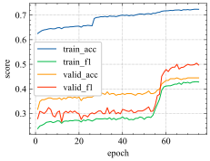

#Introduction
从网上获取的合同模板，根据网上标注的分类，将合同分为24类。一部分数据没有分类，作为测试数据集。
使用清洗过的308.5MB，59266行标注数据作为训练集；将2400行数据作为验证集，验证集参与训练，24类每类100条。

训练过程如图1所示： 

#训练集
"train_file_path": "dataset/train-phase3.csv",
"valid_file_path": "dataset/valid-phase1.csv",

#精度
75%

